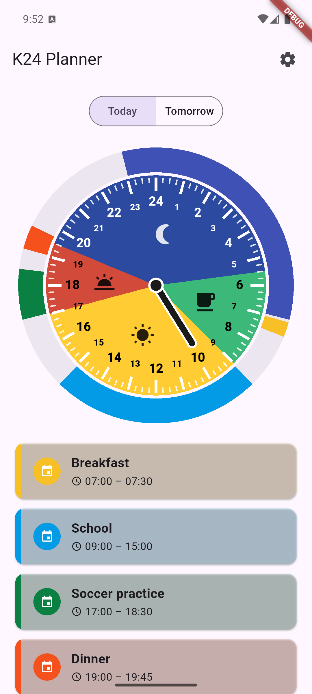

# K24 Planner

A Flutter/Dart Android app for daily task planning centered on a 24-hour analog
clock — a single hand sweeping the dial once per day, numbered 1–24, modeled after
physical 24-hour wall-planner clocks. Tasks are shown as colored arc segments on a
ring around the outside of the dial, positioned by time of day; a Today/Tomorrow
toggle switches which day's schedule is displayed.

Tasks aren't stored locally — they're the signed-in user's Google Calendar events,
fetched live via the Calendar API. The app is currently read-only: it displays a
day's schedule but has no in-app way to add, edit, or delete events (manage those
from Google Calendar itself). The settings screen lets you rename the app bar
title, switch the UI language (English, German, or Spanish), and sign out.

**[Download the APK](https://elkuku.github.io/K24HoursPlanner/)** from the
project's GitHub Pages site, published by
[`.github/workflows/pages.yml`](.github/workflows/pages.yml) on every push to
`master`.



*Screenshot from `integration_test/screenshot_test.dart`, which seeds sample
events (including an overnight task) and was run on a Pixel 6a API 35 emulator.*

See [`CLAUDE.md`](CLAUDE.md) for architecture, conventions, one-time Google Cloud
OAuth setup, and development commands.

## Quick start

```bash
flutter pub get
flutter run -d emulator-5554   # or a connected device id
flutter analyze
flutter test
```
